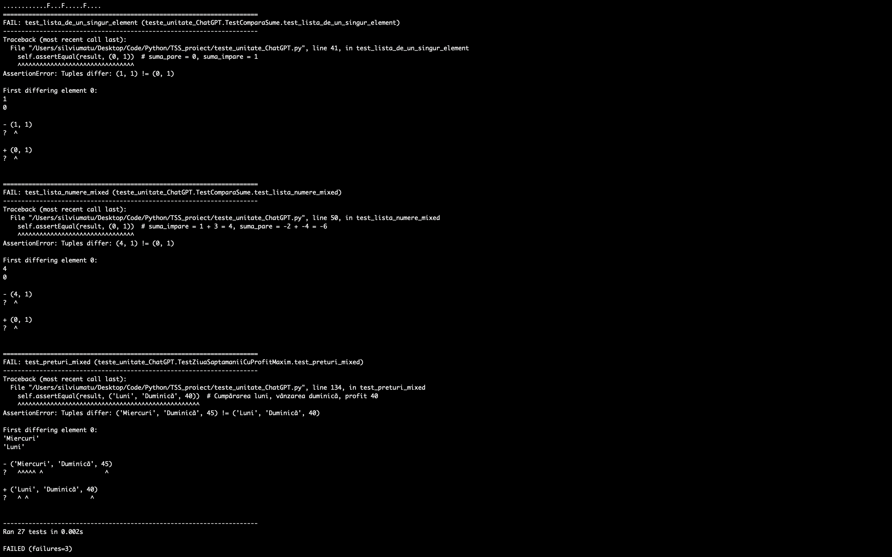
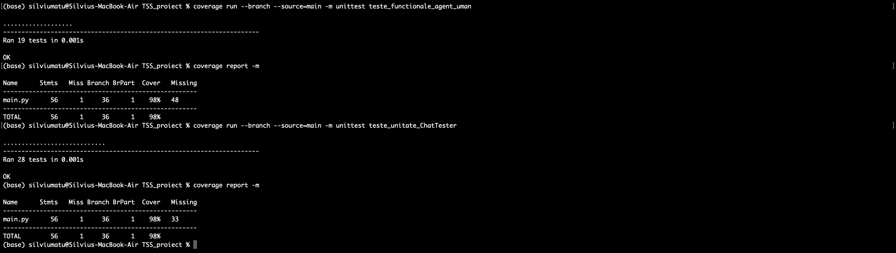

#T12
#Matu Silviu-Andrei
#Informatică ID

Proiectul a presupus analiza unui articol științific care a descris utilizarea ChatGPT pentru scrierea de teste unitare. Metoda prezentată implică utilizarea iterativă a prompturilor pentru a îmbunătăți testele generate. Autorii au evaluat ulterior performanța testelor generate cu un prompt simplu în comparație cu cea obținută prin metoda iterativă bazată pe prompturi succesive.

În exemplele practice, am implementat sub forma unor metode o serie de probleme inspirate de pe platforma LeetCode (https://leetcode.com/), adaptate pentru a reduce șansele ca un model de tip LLM să fi fost antrenat exact pe acele probleme. Ulterior, am dezvoltat teste funcționale folosind abordarea claselor de echivalență.
Urmând modelul din articol, am raportat numărul de teste care au putut fi executate și gradul lor de acoperire la nivel de instrucțiune și ramură.
Rezultatele au indicat că testele dezvoltate manual de mine au trecut în proporție de 100%. 

Testele generate de ChatGPT cu un prompt simplu au eșuat parțial (3 teste). Testele generate folosind metoda iterativă descrisă în articol au trecut în proporție de 100% după a doua iterație. Atât utilizatorul uman, cât și metoda ChatTester, au omis o singură afirmație, iar gradul de acoperire a ramurilor (branch coverage) a fost de 98% pentru ambele suite de teste.

##Rezultate teste și convergență:

Am realizat, de asemenea, un raport care prezintă pe scurt conceptele principale discutate în articol.

#Prompturi utilizate:

##Prompt simplu:
Ești un software tester profesionist. Te rog generează „unity tests” pentru următoarea metodă scrisă în python.
Pentru rulare voi folosi librăria „unittest”. Te rog generează doar testele, gata să fie rulate.
Metoda se află plasată în fișierul „main.py”. Metoda este: [metoda]

##Prompt ChatTester:

Prompt de intenție:
Inferează scopul următoarei metode:

Prompt de generare:
Ești un software tester profesionist. Te rog generează „unity tests” pentru următoarea metodă scrisă în python.
[scopul metodei]

Pentru rularea testelor voi folosi librăria „unittest”. Te rog generează doar testele, gata să fie rulate.
Metoda se află plasată în fișierul „main.py”. Metoda este: [metoda]

Scopul metodei compara_sume este să compare sumele numerelor pare și impare dintr-o listă de numere întregi și să returneze un tuplu cu două valori:
(1) suma numerelor pare sau impare – în funcție de care este mai mare și (2) un cod care indică care dintre cele două sume este mai mare 
(2 dacă suma numerelor pare este mai mare, 1 dacă suma numerelor impare este mai mare, 0 dacă sumele sunt egale).

Scopul metodei cel_mai_lung_palindrom este de a găsi cel mai lung palindrom dintr-un cuvânt dat. Aceasta verifică toate subcuvintele unui cuvânt
și returnează cel mai lung subcuvânt care este un palindrom.

Scopul metodei ziua_saptamanii_cu_profit_maxim este de a determina zilele din săptămână (pe baza prețurilor zilnice)
în care ar trebui să cumperi și să vinzi pentru a obține cel mai mare profit posibil.

Prompt iterativ:
Un test pentru metoda [numele metodei] a generat eroare
Te rog generează din nou testul respectiv. Te rog ai în vecere că doar codul testului poate fi schimbat. Textul erorii este:
